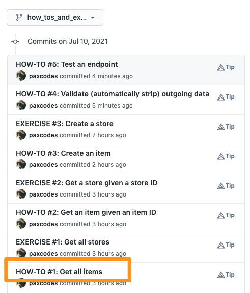
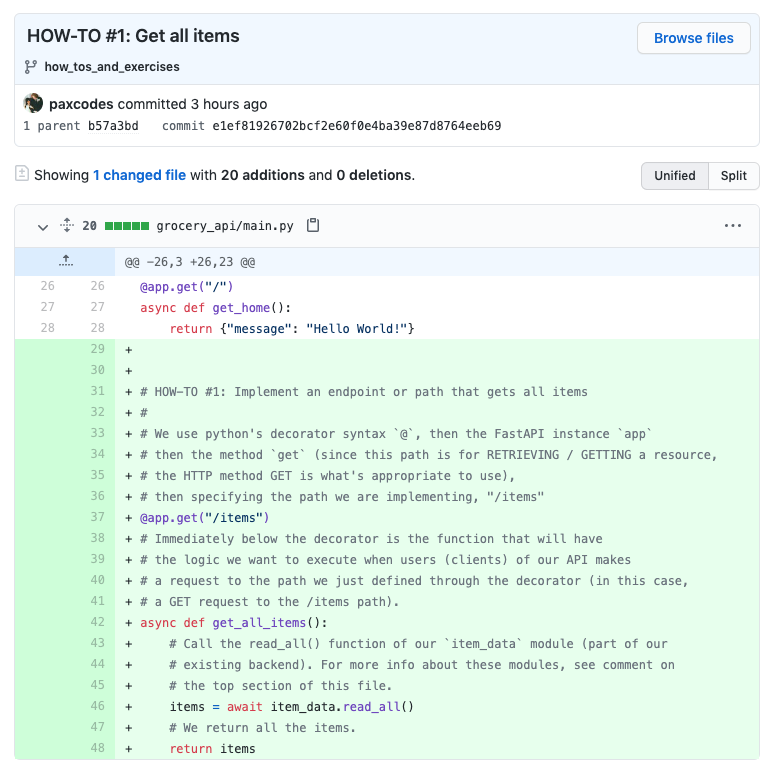

# Quick Reference for the Workshop

- [HTTP Methods](#http-methods)
- [HTTP Status Codes](#http-status-codes)
- [Helper Modules To Retrieve Data](#helper-modules-to-retrieve-data)
- [User ID for the Workshop](#user-id-for-the-workshop)
- [Python Types](#python-types)
  - [The Syntax](#the-syntax)
- [How-To's and Solutions to Exercises](#how-tos-and-solutions-to-exercises)

## HTTP Methods

POST: to create an API resource.  
GET: to read an API resource.  
PUT*: to update an API resource with a complete resource representation (e.g. completely replace it).  
PATCH*: to partially update an API resource (e.g. modify one of the fields).  
DELETE: to delete an API resource.  
  
\* PATCH is less commonly used and known than PUT. Many teams also use PUT for partial updates.  

## HTTP Status Codes

200 [Operation Succeeded] - Operation is successful  
422 [Operation Failed] - Invalid Data / unprocessable entity  
404 [Operation Failed] - Resource not found  

To learn more about status codes and what other status codes there are, see
the [MDN docs](https://developer.mozilla.org/en-US/docs/Web/HTTP/Status).
  
## Helper Modules To Retrieve Data

These are the "helper modules" to retrieve data. We will use these inside our paths' 
functions. They are already imported for you in `main.py`. E.g.

`from grocery_api.data import store as store_data  # noqa`

You can also think of these modules as our existing "backend" or
"functionalities" which we will make accessible via the web using
the API we will be creating with the FastAPI framework.

To use them,

```python
# To get all store resources
store_data.read_all()

# To get a specific store resource given a store ID, store_id
store_data.read(store_id)

# To create a store resource given a python dictionary, new_store_dict
store_data.create(new_store_dict)
```

## User ID for the Workshop

In the workshop, we'll create an endpoint for a user resource and test this endpoint.
We'd need the User ID during this time.

```
c6fce069-4748-499d-a85d-bf310bfd534b
```

## Python Types

These are types relevant for the workshop. They are all included in Python's standard library (based on Python 3.8).

[Built-in types](https://docs.python.org/3/library/stdtypes.html): `str`, `int`, `bool`

From the [`typing` package](https://docs.python.org/3.8/library/typing.html):

- `Optional` (e.g. `Optional[str]` - an optional string; can be an instance of a string or `None`)
- `List`* (e.g. `List[Item]` - a list of `Item` instances)
- `Dict`** (e.g. `Dict[dict]` - a dictionary of dictionaries)


\* When not specifying the type of _what is in the list_, using `list` is sufficient to use for typing.  
** When not specifying the type of _keys and values in the dictionary_, using `dict` is sufficient to use for typing.

💡 In 3.9, `List` and `Dict` are deprecated. You can use `list` and `dict` and also specify the types of their elements / keys and values.

From other packages in the standard library: 

- `from enum import Enum` - To limit the variable to predefined values
- `from decimal import Decimal` - When precision is important (e.g. prices)

### The Syntax

```
[variable-name]: [type]
```

Examples,


```python
from typing import Optional


class Item:
    name: str
    description: Optional[str]
```

```python
async def add(num1: int, num2: int):
    return num1 + num2
```

## How-To's and Solutions to Exercises

In the [`how_tos_and_exercises` branch](https://github.com/paxcodes/grocery_api/commits/how_tos_and_exercises), you will see the code we will go through during the workshop along with the explanation behind them. This is helpful when you have to be away for a while and may have missed something during the workshop.





You will also see solutions to the exercises (those with "EXERCISE" in the beginning of the commit message) in case you get stuck or don't have enough time to finish the exercises.
