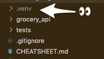

# Grocery API

The initial repository for PyLadies Hamburg's "Introduction to FastAPI" workshop.

⚠️ ⚠️ You must run the entire set-up **BEFORE** the workshop. The following instructions
need to be run in a terminal (works best with bash shell). ✅ are instructions to make
sure that everything will work expectedly during the workshop and the environment is
setup properly.💡 are notes to explain what the step is about.

## Requirements

The [setup instructions](#setup) assumes you already have the following:

- Git
- Python 3.8 (if you have an existing installation of 3.9, that works too)
- The code editor you are most comfortable using

## Setup<sup>[1](#myfootnote1)</sup>

1) Clone this repository  
   a) In your terminal, execute `git clone https://github.com/paxcodes/grocery_api`  
   b) Still in the terminal, change your working directory: `cd grocery_api`

2) Create the virtual environment
   * Using your python3.8 (or 3.9), run the command `[PYTHON_EXECUTABLE] -m venv --prompt "grocery_api" .venv`
   * E.g. `python3 -m venv --prompt "grocery_api" .venv`
   * ✅ A `.venv` folder will be created inside the project folder.

      

3) Activate your virtual environment: `source .venv/bin/activate` <sup>[2](#myfootnote2)</sup>
   * ✅ Your terminal prompt will be prefixed with `(grocery_api)` once the virtual environment is activated.
   * ✅ Running `which pip` and `which python` should output the `.venv` directory inside your `grocery_api` folder. (e.g. `/grocery_api/.venv/bin/pip` and `/grocery_api/.venv/bin/python`)
   * ✅ Running `python --version` should output 3.8/3.9. If it isn't, delete your `.venv` folder and repeat Step #2 onwards.

4) Install dependencies: `pip install -r requirements.txt`
   * 💡 This installs fastapi, uvicorn, pytest, requests, etc. and their dependencies. When creating your own FastAPI project, you'd do `pip install fastapi` etc.
   * ✅ It should output something like, `Successfully installed ... fastapi-0.65.2 ... uvicorn-0.14.0 ... pytest-6.2.4 ... requests-2.25.1`
   * ✅ Running `which uvicorn` or `which pytest` should output the `.venv` directory inside your `grocery_api` folder. (e.g. `/grocery_api/.venv/bin/uvicorn` and `/grocery_api/.venv/bin/pytest`)
   

5) Install the project: `pip install -e .`
   * 💡 This will install the grocery_api package locally. This is necessary to do for `pytest` to work.
   * ✅ It should output something like, `Successfully installed grocery-api-1.0`

6) Run tests in the terminal by typing, `pytest` 
   * ✅ It should output,
      ```
      ...
      collected 25 items

      tests\test_endpoints.py .                  [  4%]
      tests\crud\test_item.py ...........        [ 48%]
      tests\crud\test_store.py ...........       [ 92%]
      tests\crud\test_user.py ..                 [100%]

      ============== 25 passed in 0.XXs ===============
      ```

7) Run the server: `uvicorn grocery_api.main:app`
   * ✅ It should say,
      ```sh
      INFO:     Application startup complete.
      INFO:     Uvicorn running on http://127.0.0.1:8000 (Press CTRL+C to quit)
      ```

8) Go to your browser and visit, http://127.0.0.1:8000
   * ✅ It should say, `{ "message": "Hello World!" }`

9) Exit the server by pressing `Ctrl+C` in the terminal.

If you have made it all the way to the end and everything is as expected (✅), you have successfully setup your environment and ready for the workshop!

If you are having trouble with any of the steps, reach out in PyLadies' Slack channel #city-hamburg.

<a name="myfootnote1">1</a>: Instructions are based on MacOS but if you use Git Bash in Windows, the instructions should be fairly the same.  
<a name="myfootnote2">2</a>: In Windows, this would be `source .venv/Scripts/activate`
